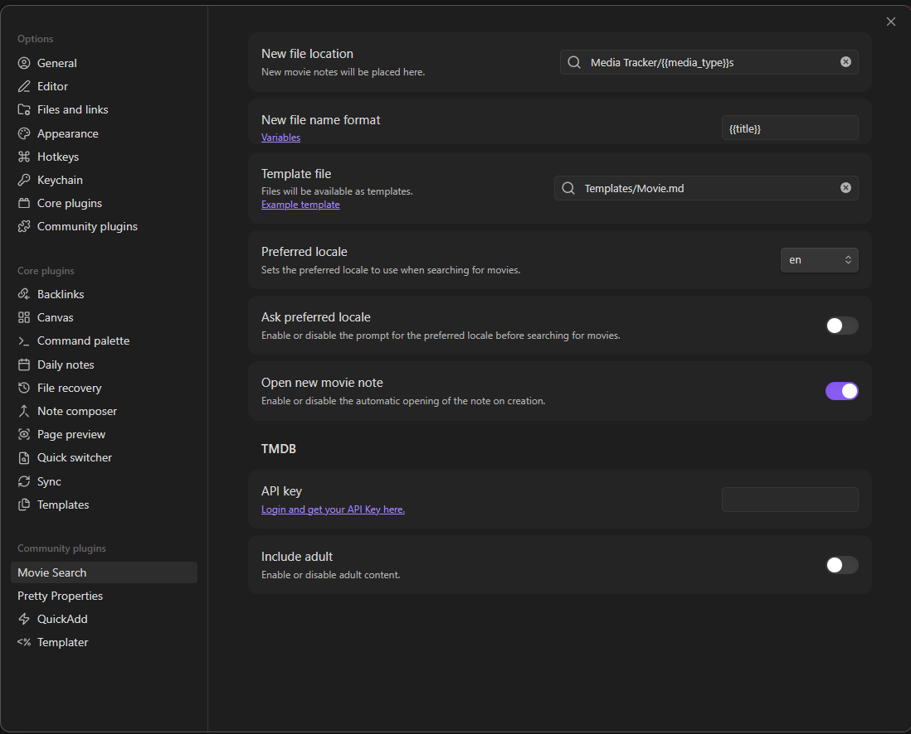
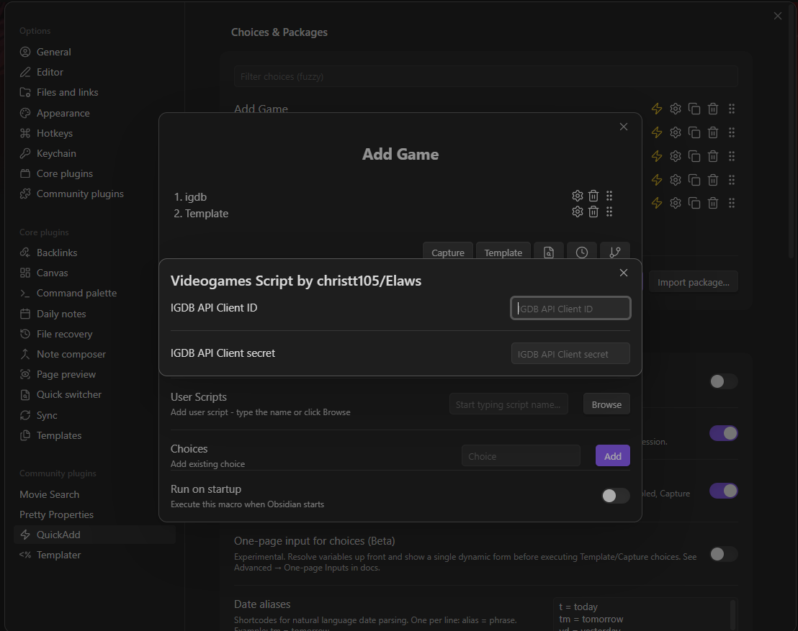
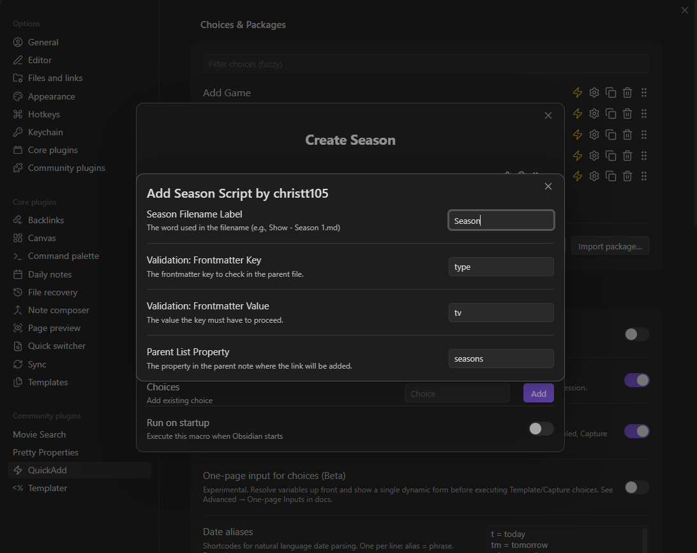
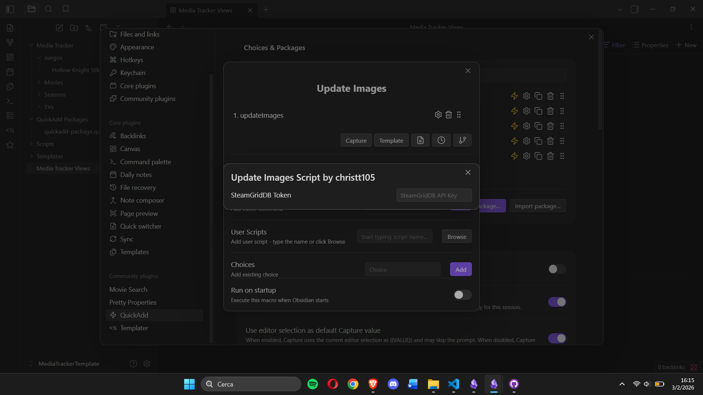

# Media Tracker Obsidian Template

This is an example [Obsidian](https://obsidian.md) vault featuring a media tracker for movies, TV shows and video games. The vault utilizes [**Movie Search**](obsidian://show-plugin?id=movie-search), [**Templater**](obsidian://show-plugin?id=templater-obsidian), and [**QuickAdd**](obsidian://show-plugin?id=quickadd) plugins to automate media management and provide various functionalities. It also adds [Pretty Properties](obsidian://show-plugin?id=pretty-properties) plugin for better display covers and banners. 

Media data is sourced from [TMDB](https://www.themoviedb.org/), [IGDB](https://www.igdb.com/) and [SteamGridDB](https://www.steamgriddb.com/), and a free API token for each service is required for the scripts to function.

> [!WARNING] 
> **This is a personal project and can be difficult to set up.**
> If you encounter any issues, please feel free to open an issue on the repository. If there is significant interest in a more user-friendly experience, I may consider condensing these features into a standalone plugin for Obsidian.

## Configuration Guide
To make the tracker fully functional, you must configure several API keys and settings.

### 1. Movie Search (TMDB)
You need to add your **TMDB (The Movie Database)** token to the Movie Search plugin configuration. [Create an account and get your token](https://www.themoviedb.org/settings/api).

### 2. QuickAdd Configuration
Open the QuickAdd settings in Obsidian to configure the following macros:

#### Video Games (IGDB)
1. Login in https://dev.twitch.tv/login.
2. Go to ["Applications" tab](https://dev.twitch.tv/console/apps).
3. Click on Register a new Application.
4. Fill the data with following
    - Name: whaterver you want
    - URL: `http://localhost`
    - Category: Application Integration
    - Client Type: Confidential
5. Go to manage. There you can now copy the Client ID and Client Secret.
6. Go to Obsidian -> QuickAdd Settings plugin and locate the **"Add Game"** macro and click the gear icon ⚙️ (Configuration).
7. Inside the macro, find the **igdb** script step and click its gear icon ⚙️.
8. Paste your **IGDB API Client ID** and **API Client Secret**.

#### Seasons
In the **"Create Season"** macro settings, you can modify the values to customize how TV show seasons are created regarding the [Season Template](MediaTrackerTemplate/Templates/Season.md).

#### Update Images (SteamGridDB)
For the **"Update Images"** action:
1. Go to its configuration settings.
2. Enter your **SteamGridDb** token. You can generate it from [here](https://www.steamgriddb.com/profile/preferences).

## How to Use

### Movies & TV Shows
To add a new movie or series, run the command `Movie Search: Create new movie note` or press `Ctrl+Shift+M`. Type the title and select the correct entry from the list.

### TV Seasons
To create seasons, open a specific TV series note and run the command `QuickAdd: Create Season`. Enter the season number, and a new note linked to the series will be generated automatically.

### Video Games
To add a video game, run the command `QuickAdd: Create Game` or press `Ctrl+Shift+G`. Search for the game and select it from the results.

* **Missing Steam ID:** If a Steam game is missing its Steam ID, run the command `QuickAdd: Search Steam Id`, enter the name, and select the matching game to update the metadata.

### Updating Images
To change the artwork, run the command `QuickAdd: Update Images` or press `Ctrl+Shift+I`. Choose between **Cover** or **Backdrop** and select your preferred image from the list.

## Attribution
This project uses data and images from the following services:
*   [The Movie Database (TMDB)](https://www.themoviedb.org/)
*   [IGDB](https://www.igdb.com/)
*   [SteamGridDB](https://www.steamgriddb.com/)
